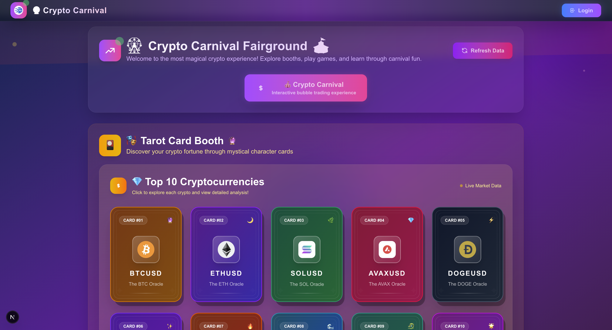
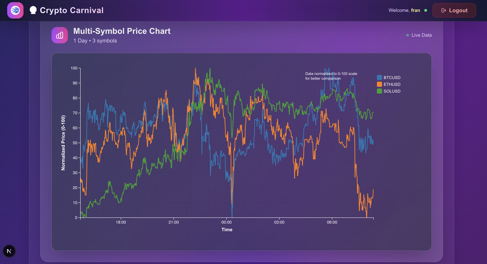
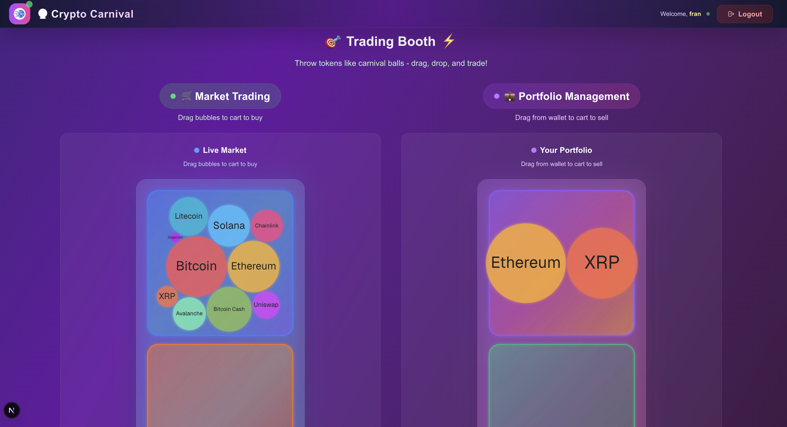
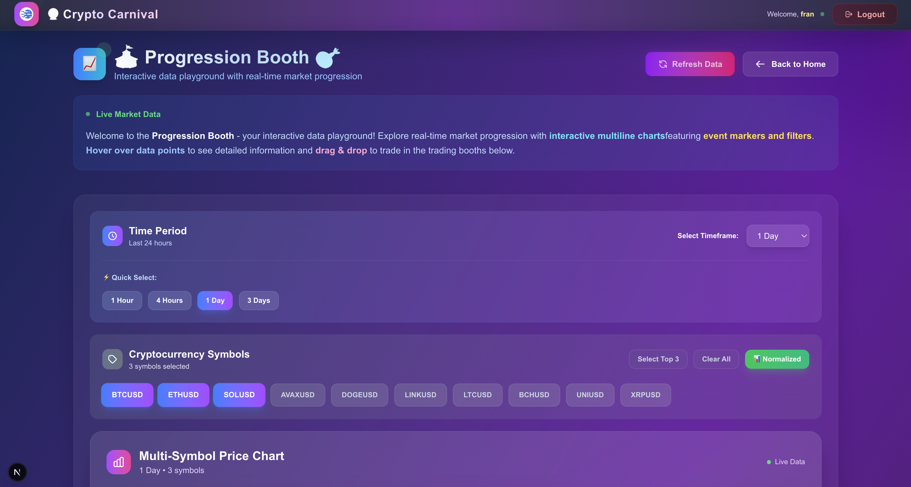
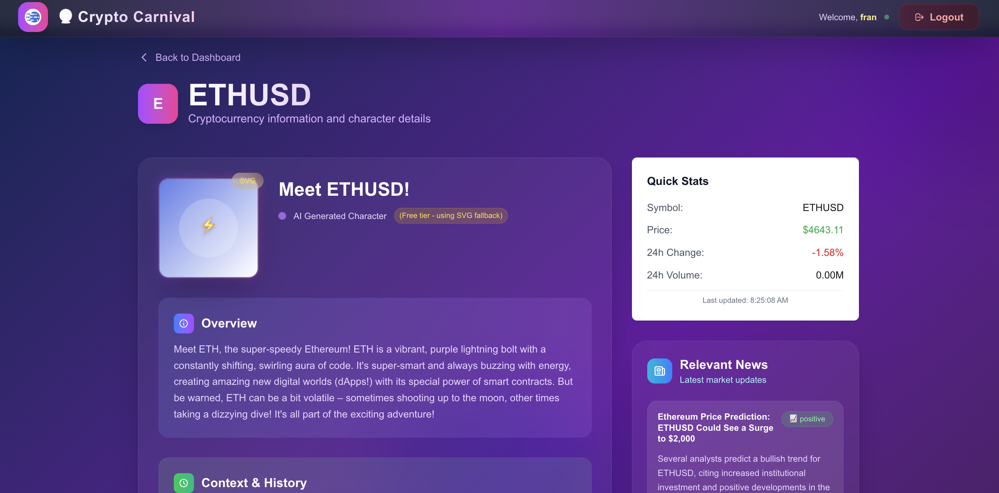
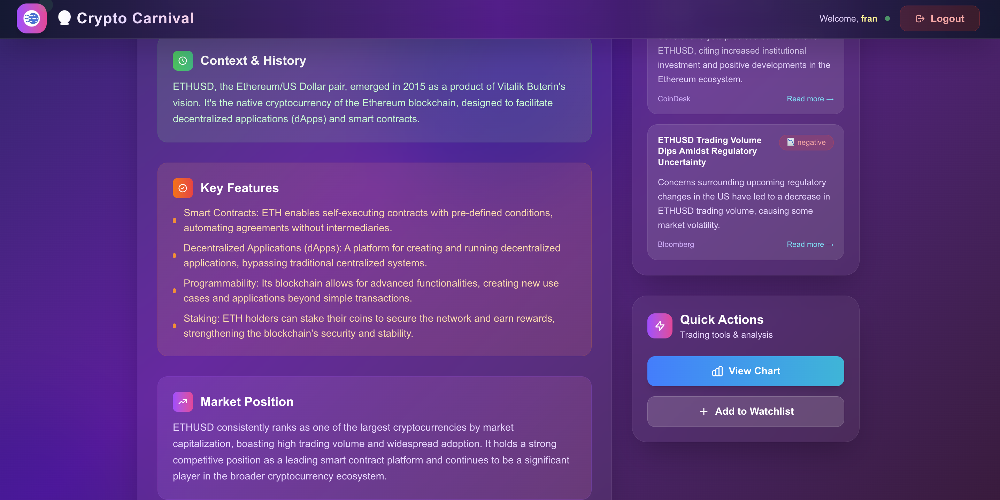

# Cryptocurrency Visualization and Trading Simulator

Make sure `Node.js` and a package manager is installed. (`pnpm` is recommended)

To start all 4 services (frontend, backend, database API, and database crawler), simply run the following script from the project root directory:

```sh
./script.sh build
./script.sh run
```

To stop all running services, press `Ctrl+C` in the terminal where the script is running

Port Specifications:

+ Frontend (main entrance): port 80
+ Backend (user data): port 3000
+ Database API (crypto data endpoint): port 4000 

## Inspiration

Cryptocurrency is an emergent technology. The distributed algorithms and cryptography tools make cryptocurrency special and equal to everyone. However, as beginners to this field or someone who has never traded with crypto, it can be difficult to understand the mechanism of cryptocurrency and the professional analysis/trading platforms.

So we aim to develop a tool, to make it easier for beginners to understand the crypto trend, with intuitive visualizations of financial metrics and interactive simulations.

## What it does

We mainly focus on the most popular cryptocurrencies. We provide the following web interfaces:

+ A multi-line chart of the values of cryptocurrencies v.s. time, supporting filtering over time and mode switching to portfolio
+ A simulation game for users to buy, hold and sell different crypto currencies and understand there market values along with also news reports affecting them.
+ A descriptive page of KPIs, news and 

## How we built it

We have 3 major parts, frontend, backend, and data service.

+ For frontend, we use React + Next.js. The visualizations are made with D3.js. We also used Google Gemini API to get descriptive texts. 
+ For backend, we use Node.js as the web server and sqlite3 as the database. The user authentication is done with JWT tokens.
+ We have used Gemini Crypto services API key to pull market data.
+ For Data service, we also use sqlite3 as the engine. We use Node.js to crawl and serve data, and GEMINI as the data source.

## Challenges we ran into

There were a few major challenges we ran into.

+ Filtering out data by timestamps and time intervals and displaying it on the frontend visuals was a major challenge.
+ Coming up with a good design to visualize the value of cryptocurrencies.

## Accomplishments that we're proud of

+ Completing the gamification of the trades and creating a interactive way to learn from it.
+ Data analysis and the market study and demand for a solution like our website.
+ Figuring out how to update the website with REAL Time Data updates using the API and Web sockets

## What we learned

+ Learning how to use Google Gemini to debug and generate code 
+ Learned how to integrate different data visuals to a single webpage.
+ Gained knowledge on accessing different services simultaneously on our system

## What's next for Crypto Carnival

We want to take this beyond from just a learning tool for few Cryptocoins to a whole interactive market experience.

+ Increasing the game portion of the webpage (adding interactive community like leaderboards).
+ AI powered insights and tips for the new users on what currencies to watch for and alerts for currencies that might lose value based off global news.
+ Creating a mobile app experience to accustom beginners to apps like Coinbase or Robinhood.
+ Expanding from just cryptocurrencies to stock and share market updates and trading on the Carnival.

## Screenshots











